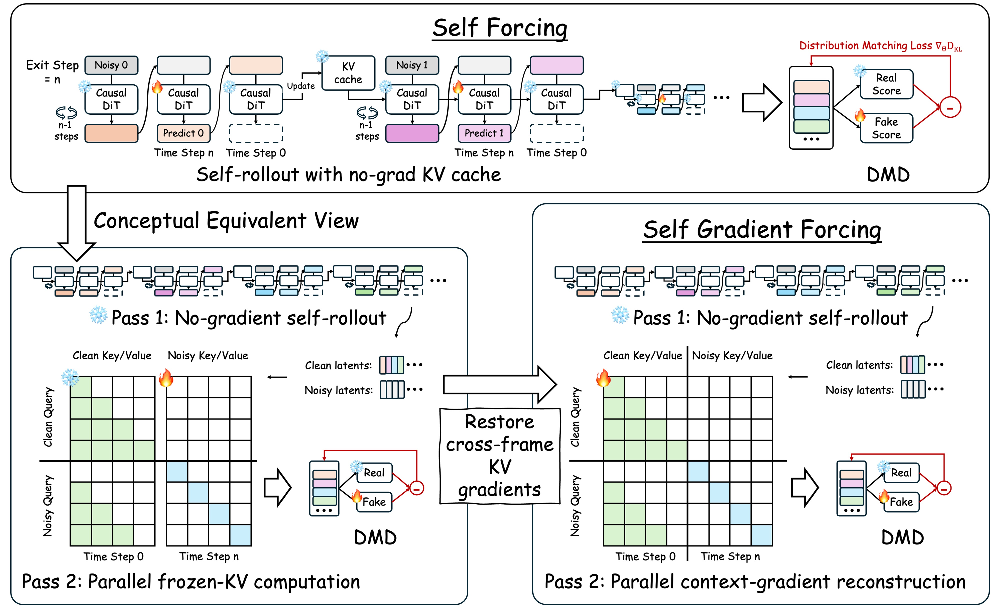

# Reproduction: Self Gradient Forcing — Native Long Video Extrapolation (arXiv 2607.20368)

> **Reproduction study — verdict: reproduced (bounded training budget).**
> All three central claims validated on the released Wan2.1-1.3B frame-wise
> implementation: (1) SGF's two-pass replay restores future-loss gradients to
> the context KV-writing path (structurally absent under frozen-cache Self
> Forcing); (2) the parallel replay matches the serial rollout to 1.33%
> relative L2 (paper: 1.41%) while naive differentiation through the rollout
> OOMs a 96GB GPU at every tested length; (3) from the same init under a
> matched 250-step budget differing by one config line, SGF reaches 0.844
> DINO subject consistency at 60s vs 0.685 for frozen-cache Self Forcing,
> and the gap persists out to 240 seconds (0.829 vs 0.675; init 0.549,
> authors' full 1500-step release 0.904).
>
> 📄 **[Detailed report](reports/reproduction/report.md)** ·
> 📓 **[Tutorial notebook](notebooks/reproduction.py)**
> [](https://molab.marimo.io/github/alphaXiv/self-gradient-forcing-0cd4806e/blob/main/notebooks/reproduction.py)

**Compute** — operator's Kubernetes cluster, 2×8 NVIDIA RTX PRO 6000
Blackwell (96GB, sm_120), peak 16 concurrent GPUs, ~4.8h elapsed. Blackwell
notes: no flash-attn wheel → torch-SDPA fallback (exact here since
`k_lens=None` throughout); flex_attention compiled with
`max-autotune-no-cudagraphs` (default kernel exceeds sm_120's ~99KB shared
memory); fixed a `[:, :, :-0]` empty-slice edge case for sequence lengths
divisible by 128.

**Downscaling vs the paper** — 250 training steps (50 generator updates) vs
1500; 8 release prompts, matched seeds; VBench-style DINO/CLIP metrics
reimplemented rather than the official VBench pipeline. The released
1500-step checkpoint is evaluated alongside as the full-training reference.

## Experiment log

Fixed run contract: every experiment branch runs `bash run.sh` under orx on
the Kubernetes backend, with its resource shape in a committed manifest
(`.orx/k8s.yaml`, 8-GPU training/eval shape in `.orx/k8s-train.yaml`).

| Branch | Purpose | Run command | Outcome | Compute |
|---|---|---|---|---|
| [orx/baseline-env-probe-weights-to-pvc](../../tree/orx/baseline-env-probe-weights-to-pvc) | Env bootstrap on Blackwell, weights → shared PVC, smoke two-pass rollout | `bash run.sh` | done — env validated, 3-frame two-pass backward grad_norm 0.96 | 1 GPU |
| [orx/probe-gradient-path-to-context-kv-writes](../../tree/orx/probe-gradient-path-to-context-kv-writes) | Claim 1: future-loss gradient path to KV writes, SGF vs frozen cache | `bash run.sh` | done — SGF: nonzero context grads (causally structured); control: no path (8/8 absent) | 1 GPU |
| [orx/probe-pass-2-reconstruction-fidelity-memory-scal](../../tree/orx/probe-pass-2-reconstruction-fidelity-memory-scal) | Claim 2: pass-2 fidelity + backward memory vs rollout length | `bash run.sh` | done — 1.33% rel L2; naive differentiable rollout OOM at F=6/12/21; SGF ≤42.7GB | 1 GPU |
| [orx/train-sgf-framewise-bounded-seed-42](../../tree/orx/train-sgf-framewise-bounded-seed-42) | Claim 3: SGF training, release config, seed 42, bounded | `bash run.sh` | done — 250 steps @42.8 s/step, peak 59.25GB; ckpt on PVC | 8 GPU |
| [orx/train-frozen-cache-self-forcing-control-bounded](../../tree/orx/train-frozen-cache-self-forcing-control-bounded) | Claim 3 control: identical but `grad_mode: self_forcing` (1-line diff) | `bash run.sh` | done — 250 steps @39.6 s/step, peak 53.23GB; ckpt on PVC | 8 GPU |
| [orx/eval-trained-bounded-sgf-vs-sf-checkpoints-60s-r](../../tree/orx/eval-trained-bounded-sgf-vs-sf-checkpoints-60s-r) | 60s (241-latent) identical-seed rollouts, trained pair | `bash run.sh` | done — 8+8 videos | 8 GPU |
| [orx/eval-refs-init-released-sgf-checkpoints-60s-roll](../../tree/orx/eval-refs-init-released-sgf-checkpoints-60s-roll) | 60s rollouts, init + released reference checkpoints | `bash run.sh` | done — 8+8 videos | 8 GPU |
| [orx/eval-short-5s-21-latents-all-conditions](../../tree/orx/eval-short-5s-21-latents-all-conditions) | 5s (21-latent) rollouts, all four conditions | `bash run.sh` | done | 8 GPU |
| [orx/eval-240s-horizon-for-init-released-checkpoints](../../tree/orx/eval-240s-horizon-for-init-released-checkpoints) | 240s (963-latent) rollouts, reference checkpoints | `bash run.sh` | done | 4 GPU |
| [orx/eval-trained-240s-bounded-sgf-vs-sf-at-963-laten](../../tree/orx/eval-trained-240s-bounded-sgf-vs-sf-at-963-laten) | 240s rollouts, trained pair | `bash run.sh` | done | 8 GPU |
| [orx/metrics-frame-strips-over-horizon](../../tree/orx/metrics-frame-strips-over-horizon) | DINO/CLIP/flicker metrics, drift curves, frame strips | `bash run.sh` | done — summary tables + strips on PVC, mirrored in report | 1 GPU |
| `main` | Not run as an experiment (publication surface) | — | — | — |

Early exploratory branches (`orx/probe-context-gradient-path-sgf-vs-frozen-cache`,
`orx/eval-horizon-consistency-across-checkpoints`, `orx/eval-extended-240s-horizon-963-latents`)
were superseded before producing runs and are kept only for provenance.

---

<div align="center">

# 🌀 Self Gradient Forcing

### Native Long-Video Extrapolation

<p>
  <a href='http://zhuang2002.github.io/SelfGradientForcing'></a> &nbsp;
  <a href="https://arxiv.org/abs/2607.20368"></a> &nbsp;
  <a href="https://huggingface.co/JunhaoZhuang/Self_Gradient_Forcing"></a> &nbsp;
  <a href="LICENSE"></a>
</p>

<p>
  <strong>Junhao Zhuang, Shiyi Zhang, Yuxuan Bian, Yaowei Li, Yawen Luo, Yijun Liu, Weiyang Jin, Songchun Zhang, Xianglong He, Xuying Zhang, Haoran Li, Haoyang Huang, Zeyue Xue, Nan Duan</strong>
</p>

<p>
  Joy Future Academy, JD
</p>

⭐ If Self Gradient Forcing is useful for your research, please consider starring this repository.

</div>

<p align="center">
  
</p>

## 🔥 News

- **2026-07-23**: Paper, model checkpoints, inference scripts, and training code are publicly released.

## 🧠 Method Overview

Self Gradient Forcing (SGF) recovers the missing context-gradient path for self-generated causal memory through a bounded two-pass replay, enabling models trained with only a 5-second window to extrapolate to minute-scale videos with stronger identity, layout, and temporal stability.

<p align="center">
  
</p>

## 🛠️ Installation

The environment follows the Causal-Forcing setup.

```bash
conda create -n self_gradient_forcing python=3.10 -y
conda activate self_gradient_forcing

pip install -r requirements.txt
pip install flash-attn --no-build-isolation
python setup.py develop
```

## ⬇️ Download Weights

```bash
bash scripts/download_weights.sh
```

The script uses the Hugging Face CLI command `hf` by default. Set `HF_CLI=huggingface-cli` if your environment still uses the older command name.

It downloads:

- Wan base models to `wan_models/Wan2.1-T2V-1.3B` and `wan_models/Wan2.1-T2V-14B`.
- All [Causal-Forcing](https://github.com/thu-ml/Causal-Forcing) initialization checkpoints under `checkpoints/init/framewise/` and `checkpoints/init/chunkwise/`: `ar_diffusion.pt`, `causal_cd.pt`, and `causal_ode.pt`.
- Released SGF inference checkpoints to `checkpoints/framewise/ar/model.pt` and `checkpoints/chunkwise/ar/model.pt`.
- The training prompt list to `prompts/vidprom_filtered_extended.txt`.

## 🚀 Inference

The default prompt file is `prompts/test_prompt.txt` with 8 prompts. The launcher uses 8 GPUs when at least 8 GPUs are visible; otherwise it falls back to single-GPU serial inference. By default it generates `963` latent frames, which decode to about 240 seconds of video at 16 fps.
The inference script takes the release setting name (`framewise` or `chunkwise`) and selects the matching config and checkpoint automatically:

- framewise config: `configs/self_gradient_forcing_framewise.yaml`
- chunkwise config: `configs/self_gradient_forcing_chunkwise.yaml`

The long-video KV-cache geometry is set in `scripts/infer_self_gradient_forcing.sh`. Framewise defaults to `KV_CACHE_SINK=4`, `KV_CACHE_FIFO_FRAMES=16`, and `KV_CACHE_CURRENT_FRAMES=1`, so the actual `--kv_cache_max_frames` passed to `inference.py` is `4 + 16 + 1 = 21`. Chunkwise defaults to `KV_CACHE_SINK=3`, `KV_CACHE_FIFO_FRAMES=6`, and `KV_CACHE_CURRENT_FRAMES=3`, so `--kv_cache_max_frames` is `12`.

### Framewise

```bash
bash scripts/infer_self_gradient_forcing.sh framewise
```

This uses:

```text
configs/self_gradient_forcing_framewise.yaml
checkpoints/framewise/ar/model.pt
```

### Chunkwise

```bash
bash scripts/infer_self_gradient_forcing.sh chunkwise
```

This uses:

```text
configs/self_gradient_forcing_chunkwise.yaml
checkpoints/chunkwise/ar/model.pt
```

### Custom checkpoint or prompt file

```bash
bash scripts/infer_self_gradient_forcing.sh \
  framewise \
  checkpoints/framewise/ar/model.pt \
  prompts/test_prompt.txt
```

Useful overrides:

```bash
NUM_OUTPUT_FRAMES=963 SEED=42 OUTPUT_ROOT=outputs/demo \
  bash scripts/infer_self_gradient_forcing.sh framewise
```

For trained checkpoints, pass the release setting first and the produced `logs/.../checkpoint_model_*/model.pt` path as the second argument. The script uses EMA weights by default; set `USE_EMA=0` if you explicitly want the non-EMA `generator` weights.

## 🏋️ Training

### Framewise SGF

```bash
bash scripts/train_self_gradient_forcing_framewise.sh
```

Equivalent explicit form:

```bash
bash scripts/train_self_gradient_forcing_framewise.sh \
  configs/self_gradient_forcing_framewise.yaml \
  logs/sgf_framewise
```

### Chunkwise SGF

```bash
bash scripts/train_self_gradient_forcing_chunkwise.sh
```

Equivalent explicit form:

```bash
bash scripts/train_self_gradient_forcing_chunkwise.sh \
  configs/self_gradient_forcing_chunkwise.yaml \
  logs/sgf_chunkwise
```

The launchers accept `[config.yaml] [logdir] [extra train.py args...]`, matching the multi-node launcher convention used by the reference training scripts. They support single-node and multi-node training. For multi-node jobs, run the same command on every node within the gather window. The scripts auto-register nodes through `.rendezvous/` on the shared filesystem and launch static `torchrun` with an IP master address.

Useful overrides:

```bash
GATHER_WINDOW=90 NUM_GPUS=8 MASTER_PORT=29501 ENABLE_WANDB=1 \
  bash scripts/train_self_gradient_forcing_framewise.sh logs/sgf_framewise

NNODES=2 NODE_RANK=0 MASTER_ADDR=10.0.0.1 NUM_GPUS=8 \
  bash scripts/train_self_gradient_forcing_chunkwise.sh logs/sgf_chunkwise
```

## 🙏 Acknowledgements

This implementation builds on the Wan video model ecosystem and follows the installation conventions of `thu-ml/Causal-Forcing`. We thank the open-source community for the infrastructure that made this release possible.

## 📮 Contact

For questions, please contact Junhao Zhuang at [zhuangjh23@mails.tsinghua.edu.cn](mailto:zhuangjh23@mails.tsinghua.edu.cn).

## 📜 License

This project is released under the Apache-2.0 license.

### 📜 Citation

```bibtex
@misc{zhuang2026selfgradientforcingnative,
      title={Self Gradient Forcing: Native Long Video Extrapolation}, 
      author={Junhao Zhuang and Shiyi Zhang and Yuxuan Bian and Yaowei Li and Yawen Luo and Yijun Liu and Weiyang Jin and Songchun Zhang and Xianglong He and Xuying Zhang and Haoran Li and Haoyang Huang and Zeyue Xue and Nan Duan},
      year={2026},
      eprint={2607.20368},
      archivePrefix={arXiv},
      primaryClass={cs.CV},
      url={https://arxiv.org/abs/2607.20368}, 
}
```
