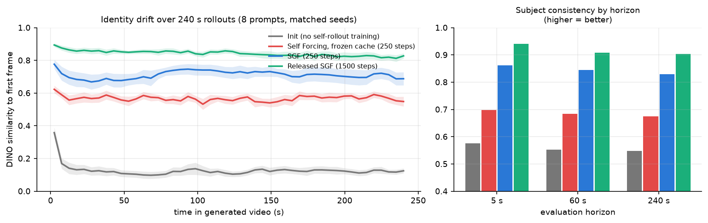
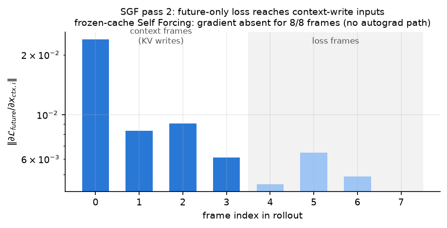
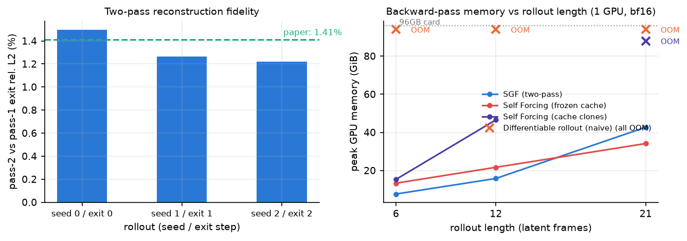
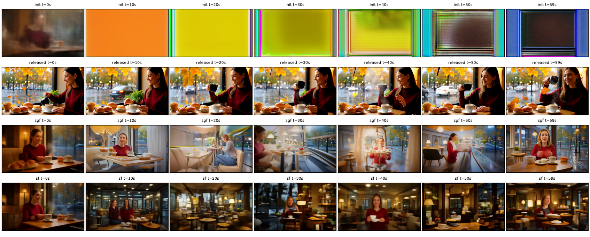
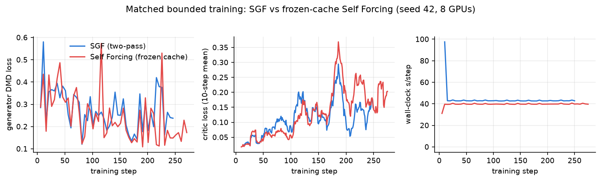

# Self Gradient Forcing, reproduced: teaching a video model to write its own memory

**Verdict: reproduced** (under a bounded training budget). On the released
Wan2.1-1.3B frame-wise implementation, all three central claims of *Self
Gradient Forcing* (arXiv 2607.20368) check out: the two-pass trainer restores
the missing gradient path into KV-cache writing, its parallel replay matches
the serial rollout to ~1.3% at bounded memory (naive alternatives OOM a 96GB
card), and under a matched 250-step budget it dramatically improves
long-horizon consistency over frozen-cache Self Forcing. Everything ran on a
Kubernetes cluster: 2×8 NVIDIA RTX PRO 6000 Blackwell (96GB), peak 16
concurrent GPUs.

**How to read the figure:** each curve tracks how similar (DINO feature
cosine) each moment of a 240-second generated video stays to its own first
frame, averaged over the 8 release prompts with identical seeds; shading is
the standard error. Higher and flatter = the video keeps its subject;
sagging = identity drift, the failure SGF targets. The untrained
initialization (gray) collapses within seconds; the frozen-cache control
(red) and SGF (blue) start from the same checkpoint and differ by one config
line, yet SGF holds ~0.15 higher at every moment out to four minutes; the
authors' fully trained release (green) continues that trajectory. The right
panel shows the same ordering at all three evaluation horizons.

## The question

Autoregressive video diffusion generates video frame-by-frame, attending to
previously generated frames through a key/value (KV) cache — the model's
working memory. "Self Forcing" trains on the model's own rollouts to remove
train/test mismatch, but with a catch: the rollout that *writes*
self-generated frames into the cache runs under `no_grad`. Losses on later
frames can teach the model to *read* its memory, never how to *write* it.
The paper names this the historical context-gradient gap and blames it for
long-horizon drift.

SGF closes the gap with two passes per training step. Pass 1 rolls out
serially without gradients, recording each frame's sampled denoising "exit"
state and the clean latents written into the cache. Pass 2 discards the
serial cache and replays all frames in parallel as one teacher-forced
sequence — recorded noisy inputs attend to recorded (stop-gradient) context
latents — with gradients on, so the loss finally reaches the computation that
encodes context into K/V.

## Claim 1 — the gradient path is really restored (and really was missing)

We rolled out 8 frames from the released initialization, substituted a
gradient leaf for the context latents fed to Pass 2, and backpropagated a
loss on only the last 4 frames. In SGF, this future-only loss produces
nonzero gradients on every earlier frame's context latent (norms 2.4e-2 →
4.9e-3), and exactly zero on the final frame — nothing later attends it, so
the causal structure is visible in the gradients. The recorded rollout
tensors are verified stop-gradient, matching the paper's stated gradient
boundary. In the frozen-cache Self Forcing control (gradients flow only
through each frame's exit-step *read* of the frozen cache), the same probe
finds **no autograd path at all** to any cache-write input (8/8 absent),
while read-path parameter gradients stay healthy (k/v-projection grad norm
0.50 vs SGF's 0.43). **Assessment: aligned.**

## Claim 2 — faithful replay at bounded memory

Pass 2's reconstruction of the Pass-1 exit predictions differs by **1.33%**
mean relative L2 over three rollouts (paper: 1.41%, attributed to bf16
roundoff), with flat ~1–2% per-frame errors. On memory: the naive
alternative — differentiate through the rollout so gradients flow through the
serial cache — cannot even run as released (in-place cache writes into
no-grad buffers silently detach); with a graph-retaining cache it **OOMs a
96GB card at every length we tried, even 6 frames** (activation checkpointing
cannot be used across a mutating cache). A serial variant that clones the
cache per frame exceeds 93GB by 21 frames. SGF's two-pass peaks at 42.7GB at
the full 21-frame training window — and is bounded by that window no matter
how far the model later extrapolates. In the real 8-GPU training runs (14B
DMD teacher, FSDP), SGF cost **+6.0GB peak (59.2 vs 53.2) and +8.0%
wall-clock (42.8 vs 39.6 s/step)** over the control — the paper reports
+8.0GB and +12.7% at larger absolute scale. **Assessment: aligned.**

## Claim 3 — matched bounded training improves long horizons

We trained SGF and frozen-cache Self Forcing from the same released
initialization with identical configs, seeds, and data streams — the diff is
one line (`grad_mode`) — for a matched budget of 250 steps (50 generator
updates; the paper trains 1500) on 8 GPUs each, then sampled all conditions
with identical seeds on the 8 release prompts using the release's streaming
KV policy (4 sink + 16 FIFO latents).

DINO subject consistency (VBench formula) across horizons, with 60-second
background consistency (CLIP) and flicker alongside:

| condition | subject @5s ↑ | subject @60s ↑ | subject @240s ↑ | background @60s ↑ | flicker MAD @60s ↓ |
|---|---|---|---|---|---|
| init (ar_diffusion) | 0.575 | 0.553 | 0.549 | 0.678 | 0.101 |
| Self Forcing, frozen cache (250) | 0.697 | 0.685 | 0.675 | 0.741 | 0.058 |
| **SGF (250)** | **0.863** | **0.844** | **0.829** | **0.867** | **0.024** |
| released SGF (1500) | 0.941 | 0.908 | 0.904 | 0.928 | 0.032 |

The ordering init < frozen-cache < SGF < released holds for every metric at
every horizon,
and the strips show what the numbers mean: the initialization collapses to
color fields within ~10s; the frozen-cache control keeps generating but
churns through scenes and loses the subject; SGF-250 keeps the woman in the
burgundy sweater and her café through 60s with visible wobble; the released
model is essentially stable.

One nuance the bounded budget adds: at 250 steps SGF is already better
*at the 5-second horizon* (0.863 vs 0.697), so our
run shows a uniform improvement rather than the paper's "comparable at 5s,
better at long horizons" pattern. We attribute this to the short budget —
50 generator updates of frozen-cache DMD appear to degrade local consistency
before its long-horizon behavior can equilibrate — and to metric coupling
(a subject that drifts also scores worse locally). **Assessment: aligned on
the long-horizon claim; the short-horizon "no degradation" claim is
consistent with our data (SGF never scores below the control) but our budget
cannot separate "comparable" from "better."**

## What it took to run on Blackwell

The release assumes flash-attn and H100-class kernels; on RTX PRO 6000
(sm_120) we (a) fell back to torch SDPA where flash-attn is called (`k_lens`
is always `None` in this codebase, so the fallback is exact), (b) compiled
flex_attention with `max-autotune-no-cudagraphs` because the default kernel
wants 126KB of shared memory vs the card's ~99KB, and (c) fixed a release
edge case where sequences divisible by 128 produced empty attention outputs
(`[:, :, :-0]`). Otherwise we ran the release's exact 8-GPU FSDP recipe;
wall-clock per step is ~18× the paper's hardware.

## Limitations

- **Bounded budget**: 250 steps / 50 generator updates vs the paper's 1500;
  we test the *direction* of the training signal, not absolute quality. The
  released 1500-step checkpoint provides the full-training reference point.
- **Control reimplemented**: the release ships SGF only; our frozen-cache
  Self Forcing keeps the release's rollout and takes gradients through
  exit-step reads of a frozen (counter-snapshotted) cache.
- **Metrics**: VBench-style subject/background/flicker reimplemented with
  DINO ViT-B/16 and CLIP ViT-B/32 per the VBench formulas — not the official
  VBench pipeline; aesthetic/imaging dimensions not evaluated. Single seed
  per condition (matched); 8 prompts.

## Compute

Operator's Kubernetes cluster (2 nodes × 8 NVIDIA RTX PRO 6000 Blackwell
Server Edition, 96GB), peak 16 concurrent GPUs (two simultaneous 8-GPU
training jobs), ~4.8 hours elapsed wall time across 13 terminal runs (plus the two
training runs, cancelled by design after saving their matched step-250
checkpoints). Exact manifests,
configs, and terminal logs live on the `orx/*` experiment branches (table in
the README).
